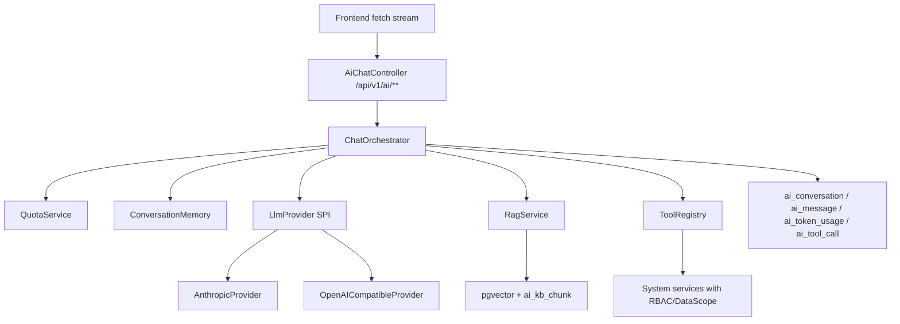

# AI 能力接入 Sprint 设计

> ## ⚠ 本文档状态 (Round 3 F1 处置, 2026-07-06)
>
> 下文从「## 结论」到「## 官方来源」是 **Round 0 原始方案**, 其"新增 quantum-biz-ai 模块跑在单体内"的定位
> 已被 Round 1 critic 否决 (F1 P0)、Round 2 re-scope **改归属为未来独立 ai-service 项目 (平面 C) 的设计附件**,
> 不代表 quantum-backend 仓库范围。本仓库的权威范围与治理架构见 `docs/ai-sprint-design.md` (三平面 + 两契约)。
> 阅读顺序建议: 先读文末 Round 1/2/3 三段, 再按 Round 2 归属表理解正文。

## 结论

第一版 AI 能力不直接拆微服务, 新增 Maven 模块 `quantum-biz-ai` 跑在现有单体内。模块内部按未来 `ai-service` 拆分边界设计: Controller 只做 HTTP/SSE 协议, `ChatOrchestrator` 做会话编排, `LlmProvider` 做模型适配, `RagService` 做检索增强, `ToolRegistry` 做系统能力开放, `QuotaService` 和审计表独立计量。业务源码实现等 Claude review 后另开 sprint。



## 现有约束

- 项目是 Maven 多模块单体: root `pom.xml` 聚合 `quantum-common`, `quantum-biz-system`, `quantum-server`。
- 技术底座是 Spring Boot 4.1.0, Java 25, PostgreSQL, Redis/Local cache, MyBatis-Flex。
- 安全底座已有 JWT、RBAC、`@RequiresPermission`、数据权限、`@Sensitive` 脱敏、`RepeatSubmitFilter`、`RateLimitFilter`。
- 近期已完成 CORS 白名单、数据权限 fail-closed、登录态角色聚合数据权限、用户导入契约收敛。

## 模块边界

新增模块:

```text
quantum-biz-ai
  controller       # SSE / 对话 / KB 管理接口
  application      # ChatOrchestrator, command/query use cases
  provider         # LlmProvider SPI, Anthropic/OpenAI-compatible adapter
  rag              # 文档切分, embedding, 检索, rerank hook
  tool             # ToolRegistry, ToolExecutor, tool schema
  quota            # token 预检, 预扣, 回补, 用户/部门/租户额度
  persistence      # ai_* mapper/domain/dto
  security         # AiExecutionContext, ticket, audit redact
```

依赖方向:

```text
quantum-server -> quantum-biz-ai -> quantum-biz-system -> quantum-common/*
quantum-biz-ai -> quantum-common-security/cache/file/orm/framework/logging
quantum-biz-system 禁止反向依赖 quantum-biz-ai
```

拆服务时只移动 `quantum-biz-ai` 与 `ai_*` schema, 对外保留 `/api/v1/ai/**` API 和 ToolRegistry 契约。

## API 形态

| API | 方法 | 说明 | 鉴权 |
|---|---|---|---|
| `/api/v1/ai/chat/stream` | POST | fetch streaming; 支持 Authorization header; 默认方案 | `ai:chat:use` |
| `/api/v1/ai/chat/tickets` | POST | 生成一次性短时 stream ticket; EventSource 兼容方案 | `ai:chat:use` |
| `/api/v1/ai/chat/events?ticket=` | GET | SSE EventSource fallback; 只接受短时 ticket | ticket |
| `/api/v1/ai/conversations` | GET | 会话列表 | 数据权限 |
| `/api/v1/ai/kb/documents` | POST/GET/DELETE | KB 文档管理 | `ai:kb:*` |
| `/api/v1/ai/usage` | GET | token 用量 | 本人/管理员 |

默认前端用 `fetch` 读取 `ReadableStream`, 因为 WHATWG `EventSource` 构造只有 URL 和 `withCredentials`, 没有自定义 Authorization header 参数。需要原生 EventSource 时, 先换一次性 ticket。

## Provider 抽象

推荐自研薄 SPI, 同时保留 Spring AI adapter:

```java
public interface LlmProvider {
    String providerKey();
    LlmCapabilities capabilities();
    Flux<LlmDelta> stream(ChatRequest request, AiExecutionContext context);
    LlmResponse complete(ChatRequest request, AiExecutionContext context);
}
```

Provider 实现:

| Provider | 形态 | 说明 |
|---|---|---|
| `AnthropicProvider` | 官方 `anthropic-java` | Claude 特性优先: streaming, prompt caching, tool use, thinking。官方 README 当前 Maven 示例是 `com.anthropic:anthropic-java:2.48.0`, 云端旧方案的 `2.34.0` 上线前需复核。 |
| `OpenAICompatibleProvider` | HTTP adapter / Spring AI adapter | DeepSeek/Qwen/DashScope/OpenAI-compatible, 统一 baseUrl/model/apiKey。 |
| `SpringAiChatModelProvider` | 可选 adapter | 利用 Spring AI `ChatModel` / `StreamingChatModel` 做统一模型抽象, 但高级缓存/tool runner 不强行抹平。 |

模型路由不写死:

| 场景 | 默认策略 |
|---|---|
| 复杂推理、代码、长上下文 | 高推理模型配置组, 如 Claude Opus/Fable 级别 |
| 常规对话、业务问答 | 中档模型配置组, 如 Sonnet/Qwen max |
| 分类、摘要、标题、意图识别 | 轻模型配置组, 如 Haiku/DeepSeek chat |
| 受监管或国内环境 | OpenAI-compatible provider 优先 |

价格和模型 ID 进入配置中心/数据库, 不进入代码常量。Claude 官方 pricing 已显示 Sonnet 5 有 2026-08-31 前过渡价, 因此上线日必须重新核价。

## Prompt Caching

Claude provider 必须支持 cache-aware request builder:

- 系统提示词、工具定义、长 KB 背景放在稳定前缀。
- 动态用户消息、时间戳、traceId、权限快照放在缓存断点之后。
- `cache_control` 只由 provider adapter 生成, 不散落业务代码。
- 请求记录保存 `cache_creation_input_tokens` / `cache_read_input_tokens` 类指标, 用于成本回溯。

约束: 断点前内容必须字节级稳定, 不在 system prompt 里插当前时间、随机 ID、用户昵称等动态字段。

## SSE 与现有安全链冲突

| 冲突点 | 设计处理 |
|---|---|
| `RepeatSubmitFilter` | `/api/v1/ai/chat/stream`, `/api/v1/ai/chat/events` 排除; AI 幂等用 conversation/message nonce。 |
| `RateLimitFilter` | 流式端点排除 QPS 限流; 改由 `QuotaService` 做 token 预算和并发会话数。 |
| `server.compression` | `text/event-stream` 不压缩, 或对 AI stream path 禁用 compression, 避免缓冲破坏实时输出。 |
| EventSource 鉴权 | 默认 fetch stream 带 Authorization; EventSource fallback 使用短时 ticket。 |
| 虚拟线程 / ThreadLocal | `ChatOrchestrator` 接收显式 `LoginUserSnapshot`; tool 执行前用 scoped context 安装/清理 `UserContext`, 不依赖 `InheritableThreadLocal` 自动传播。 |
| DB 连接占用 | 流式生成期间不持有长事务; message 分段缓存内存/Redis, 完成后批量落库。 |

## Tool Use / MCP

核心规则: 模型只能提出工具调用请求, 权限裁决仍在业务层。

Tool 注册结构:

```text
AiToolDefinition
  name
  description
  inputSchema
  permissionCode
  dataScopeMode
  riskLevel: READ | EXPORT | WRITE | ADMIN
  executorBean
```

执行流程:

1. Orchestrator 把登录用户、会话、模型请求写入 `AiExecutionContext`。
2. 模型返回 tool use。
3. `ToolRegistry` 校验 tool allowlist、参数 schema、loop 上限。
4. `ToolExecutor` 以当前登录用户身份调用既有业务 service。
5. `PermissionAspect` 和数据权限链路仍做最终裁决。
6. `AiToolCallAudit` 记录 tool、参数摘要、结果摘要、权限失败、耗时和 token。

第一批工具只开放只读:

| Tool | 权限 | 数据权限 |
|---|---|---|
| `system.user.search` | `system:user:list` | 现有用户列表数据权限 |
| `system.dept.tree` | `system:dept:list` | 当前用户部门范围 |
| `system.role.list` | `system:role:list` | 管理权限 |
| `report.export.request` | `ai:report:export` | 需二次确认 |

MCP 不在第一版实现。后续 MCP Server 只包装同一个 ToolRegistry, 不重写业务逻辑; 外部 Agent 调用和内置模型调用共享权限、审计、限流和数据权限。

## RAG 与数据模型

向量库第一版用 pgvector。理由: 项目已用 PostgreSQL, pgvector 是 PostgreSQL 扩展, 可在同一事务/备份/权限体系下管理; 量大后再评估专用向量库。

表草案:

| 表 | 关键字段 |
|---|---|
| `ai_conversation` | `id`, `title`, `user_id`, `dept_id`, `status`, `last_message_at`, `create_by`, `create_time` |
| `ai_message` | `id`, `conversation_id`, `role`, `content_redacted`, `content_cipher`, `token_input`, `token_output`, `provider`, `model`, `create_by` |
| `ai_kb_document` | `id`, `name`, `source_type`, `file_id`, `dept_id`, `visibility`, `status`, `embedding_model`, `create_by` |
| `ai_kb_chunk` | `id`, `document_id`, `chunk_index`, `content_redacted`, `embedding vector(n)`, `metadata`, `dept_id` |
| `ai_token_usage` | `id`, `user_id`, `dept_id`, `provider`, `model`, `usage_date`, `input_tokens`, `output_tokens`, `cache_read_tokens`, `cost_amount` |
| `ai_tool_call` | `id`, `conversation_id`, `message_id`, `tool_name`, `permission_code`, `args_hash`, `status`, `duration_ms`, `create_by` |

RAG 查询必须同时做向量相似度与权限过滤:

```text
embedding similarity topK
  + document status
  + visibility
  + dept_id in LoginUser.deptIds
  + create_by/self when private
```

## 配额与成本

- `QuotaService.preflight()` 在模型请求前按预计 token 做预算检查。
- `QuotaService.reserve()` 用 Redis increment 做用户/部门/日维度预扣。
- stream 完成后按 provider usage 回补真实 token 和成本。
- stream 失败时按已消耗 token 结算, 释放未用预扣。
- 管理端后续提供模型成本报表, 第一版先落 `ai_token_usage`。

## 安全与审计

- API key 只来自环境变量、KMS 或外部 secret manager, 禁止入库或写入 yml。
- prompt/response 入库先走敏感信息脱敏; 原文如必须保留, 使用加密字段并受权限控制。
- tool 参数不落完整明文, 默认存 hash + 摘要。
- 高风险 tool: 写操作、导出、删除、批量修改必须二次确认。
- Tool loop 上限默认 5, 单次模型请求总时长默认 120 秒, 超时写入可恢复状态。
- prompt injection 防线: 工具白名单、参数 schema、系统指令和工具定义只由后端生成, RAG 内容永不覆盖系统策略。

## 迁移与拆服务触发

先单体, 满足任一条件再拆 `ai-service`:

- AI SSE 长连接或 token 突发影响 CRUD 接口稳定性。
- AI 模块需要独立扩容、独立发布或独立故障域。
- 后端团队达到 8 人左右并频繁互相阻塞发布。
- 出现第二个前台产品线复用同一 AI 能力。

拆分顺序:

```text
quantum-biz-ai -> ai-service
auth-service
剩余 system 单体
```

拆分前置: 网关、服务发现、统一鉴权 token introspection、AI service 到 system service 的内部调用鉴权。

## Sprint 拆分建议

| Sprint | 目标 | 退出标准 |
|---|---|---|
| AI-0 设计审核 | 本文档 + Claude review | 审核 PASS/CONCERNS, 明确选型 |
| AI-1 模块骨架 | `quantum-biz-ai`, Provider SPI, 配置, no-op provider test | `mvn test` 通过 |
| AI-2 SSE 对话 | fetch stream, ticket fallback, 安全过滤器排除, 显式上下文 | 本地 stream smoke test |
| AI-3 配额审计 | conversation/message/token_usage 表, Redis 配额 | 并发与失败回补测试 |
| AI-4 RAG | pgvector, KB 文档切分, embedding, 权限过滤 | 数据权限 RAG 测试 |
| AI-5 Tool Use | ToolRegistry, 只读工具, 权限审计 | 越权 tool 调用被拒绝 |
| AI-6 MCP 包装 | MCP Server 包装 ToolRegistry | 外部 agent 调用同权限链 |

## Claude 审核问题

1. `LlmProvider` 自研薄 SPI + Spring AI adapter 是否比直接全量 Spring AI 更适合当前 Claude 高级能力?
2. SSE 默认 fetch stream, EventSource 仅 ticket fallback, 是否符合前端框架计划?
3. `quantum-biz-ai -> quantum-biz-system` 的依赖方向是否会阻碍未来拆 `ai-service`?
4. RAG 第一版用 pgvector 是否足够, 是否需要从一开始抽象 VectorStore?
5. Tool 执行以业务 service 为唯一入口, 是否还需要额外的 tool-level ABAC 策略表?
6. prompt/response 原文是否允许加密保存, 或第一版只保存脱敏文本?

## 官方来源

- Anthropic Java SDK README: https://github.com/anthropics/anthropic-sdk-java
- Anthropic Java SDK docs: https://platform.claude.com/docs/en/api/sdks/java
- Anthropic streaming docs: https://platform.claude.com/docs/en/build-with-claude/streaming
- Anthropic prompt caching docs: https://platform.claude.com/docs/en/build-with-claude/prompt-caching
- Anthropic pricing docs: https://platform.claude.com/docs/en/about-claude/pricing
- Spring AI ChatModel docs: https://docs.spring.io/spring-ai/reference/api/chatmodel.html
- Spring AI PGvector docs: https://docs.spring.io/spring-ai/reference/api/vectordbs/pgvector.html
- pgvector README: https://github.com/pgvector/pgvector
- WHATWG EventSource spec: https://html.spec.whatwg.org/multipage/server-sent-events.html

---

## Round 1 · Critic Findings (Claude fable-5, 2026-07-06)

> claude-review-brief.md 所请求的审核。已同步核对用户在 Claude 会话中的三点澄清（2026-07-05/06）。

### VERDICT: NEEDS_REVISION

### 评分

| 维度 | 评分 (1-5) | 关键 finding |
|---|---|---|
| 边界条件 | 4 | SSE/EventSource/ticket 分析正确且引用规范 |
| 错误处理 | 4 | 配额预扣/回补、超时可恢复状态设计完整 |
| 测试覆盖 | 3 | Sprint 退出标准有测试，但缺越权/线程上下文用例点名 |
| 历史决策对齐 | **1** | **F1：与用户已拍板的定位冲突（P0）** |
| 复杂度 | 3 | 单体内八个子包偏重，拆走后自然消解 |
| 历史教训 | 4 | 显式 LoginUserSnapshot 对齐了 DataScopeAspect fail-open 教训 |

### Findings (按严重度)

#### F1 [P0] quantum-biz-ai 的归属与用户已确认的定位冲突
- 现象: 本设计把 chat/SSE/RAG/配额/Provider SPI 放进 quantum-backend（先单体后拆）。用户已在 Claude 会话明确拍板：**quantum-backend 不做 chat、不含任何 AI 运行时**，chat 是独立项目（平面 C），从第一天就独立；quantum-backend 只提供两份契约（Convention Pack + MCP 只读能力）。"先单体后拆 + 触发条件" 路线已作废。
- 建议: 本文档除 Tool/MCP 一节外整体**改挂为未来独立 ai-service 的设计附件**；本仓库范围收敛为 `quantum-mcp`（契约②）+ Convention Pack（契约①）。治理架构见 `docs/ai-sprint-design.md`（已两轮评审）。
- 引用: docs/ai-sprint-design.md §0/§1/§4

#### F2 [P1] ToolRegistry 归属需前移到 quantum-backend 侧
- 现象: 设计中 ToolRegistry 在 quantum-biz-ai 内、"MCP 后续包装之"。若 chat 独立成项目，ToolRegistry 若随之外迁，将出现独立进程重新裁决权限。
- 建议: 采纳设计中"MCP Server 只包装同一个 ToolRegistry"的思想，但宿主定为 **quantum-backend 内的 quantum-mcp 模块**（标准 MCP 协议，Streamable HTTP/SSE；stdio 用桥接）；ai-service 与外部 agent 同为 MCP 客户端。
- 引用: docs/ai-sprint-design.md §3.2 两条硬性技术要求（UserContext fail-closed / @Sensitive 序列化路径）

#### F3 [P2] anthropic-java 版本口径
- 现象: brief 标注 README 示例 2.48.0，正确；旧方案 2.34.0 已过时。
- 建议: 版本不入代码常量（与"价格配置化"同一原则），上线前以官方 README 为准复核。

### 对 claude-review-brief 七问的裁决

1. 单体内跑 + 未来拆 → **否**，直接独立项目（用户已拍板，见 F1）。
2. 自研薄 SPI + Spring AI adapter → **是**，方向正确；Claude 走官方 SDK 保留 caching/tool/thinking，OpenAI-compatible 走统一 adapter。
3. Claude 直连官方 Java SDK → **是**。
4. SSE 清单基本完备；补两点：虚拟线程下禁用 InheritableThreadLocal 传播的决定正确（DataScopeAspect 无用户时静默跳过=fail-open，已实测确认）；`/api/v1/ai/**` 属 ai-service，不再涉及本仓库过滤器排除，本仓库只需处理 quantum-mcp 的 SSE 端点。
5. tool-level 策略表 → 第一版不需要；`permissionCode + riskLevel + 只读白名单` 够用，ABAC 等真实需求出现再加。
6. pgvector 第一版足够；VectorStore SPI 预留接口即可，不预实现（YAGNI）。
7. 审计默认脱敏保存正确；原文加密保存（`content_cipher`）作为 opt-in 列保留，密钥走 KMS，不默认开。

---

## Round 2 (re-scope by Claude, 2026-07-06)

按 F1/F2 重定范围，其余内容**不作废、改归属**：

| 内容 | Round 1 归属 | Round 2 归属 |
|---|---|---|
| ChatOrchestrator / SSE / RAG / 配额 / Provider SPI / ai_* 表 | quantum-biz-ai（本仓库） | **独立 ai-service 项目**（平面 C），本文档相应章节作为其设计附件带走 |
| ToolRegistry + 权限裁决 + 审计 | quantum-biz-ai | **quantum-mcp 模块（本仓库）**，标准 MCP 协议对外 |
| 只读工具首批清单（user.search/dept.tree/role.list） | quantum-biz-ai 工具 | quantum-mcp 的 Capability Manifest 首批能力 |
| Convention Pack + 两个 skill | （未涉及） | 本仓库 docs/ai/（已落地，见 PR #2） |
| 拆服务触发条件 | 演进策略 | 作废（天生独立） |
| `report.export.request`（高风险, 需二次确认） | quantum-biz-ai 工具 | **排除出 S3 首批**（§5 安全铁律: MCP 默认只读; 写/导出类能力需目标系统显式声明可写后另行评估, Round 3 F6 处置） |

治理文档：`docs/ai-sprint-design.md`（三平面 + 两契约，含 S3 两条硬性技术要求与 MCP 授权流程待办）。
本仓库 impl 范围（本 sprint）：S1 Convention Pack 模板全层齐套 + 模板实例化编译实证（runtime-verify）。
quantum-mcp（S3）待实现：授权流程已定案 **OAuth 2.1**（2026-07-06 用户拍板，见治理文档 §9），
待实现三个端点（`/.well-known/oauth-protected-resource` + `/oauth/authorize` + `/oauth/token`）
与 access token → LoginUser 会话映射；开工前还需补两项最小设计（token 存储对齐 + consent 页 + 跨项目接口冻结，见治理文档 §9 "S3 前置设计项"）。


## Round 3 · Critic Findings (Claude fable-5 独立 critic, 2026-07-06)

### VERDICT: NEEDS_REVISION

### Findings (按严重度, 每条带文件:行号或章节锚点证据)

#### F1 [P0] design.md 正文 (第 10-249 行) 仍以 "quantum-biz-ai 在本仓库" 视角撰写, 未随 Round 2 re-scope 改写
- 现象: `## 结论` (design.md:14)、`## 模块边界` (design.md:39-63)、`## API 形态` (design.md:65-76)、`## SSE 与现有安全链冲突` (design.md:121-130)、`## Sprint 拆分建议` (design.md:230-240) 等十余个章节, 全部按 "新增 Maven 模块 quantum-biz-ai 跑在现有单体内" 的 Round 0 方案书写, 依赖方向图 (design.md:57-61) 仍写 `quantum-server -> quantum-biz-ai -> quantum-biz-system`。Round 1 F1 已判定此方案与用户拍板定位冲突 (P0), Round 2 re-scope 表 (design.md:314-320) 只说"不作废、改归属", 但没有在正文任何一处插入指引或删除线, 后来者从头读到 `## 结论` 或 `## 模块边界` 会直接得到"chat 在本仓库内"的错误结论, 必须读到第 265 行才能看到 Round 1 的否决, 读到第 310 行才知道正文该按什么坐标系重新理解。
- 建议: 在 `## 结论` 前插入一个醒目的"本文档状态"提示块 (例如 "⚠ 第 10-261 行是 Round 0 原始方案, 已被 Round 1/Round 2 重新归属为独立 ai-service 的设计附件, 不代表 quantum-backend 仓库范围; 权威范围见 docs/ai-sprint-design.md"), 而不是仅在文末补丁。
- 引用: Round 2 表格自身 (design.md:314-320); docs/ai-sprint-design.md §4 "明确移出 quantum-backend 的清单" (第 135-149 行) 与正文内容逐条矛盾但未在正文出现交叉引用。

#### F2 [P0] design.md frontmatter 与 sprint 实际状态不一致
- 现象: design.md:4-6 `stage: design`, `status: draft-for-claude-review`, 但本 sprint 已实际走完 review (reviews/pass1.md VERDICT=CONCERNS) → polish (cleanup-pass.md VERDICT=PASS) → 已 ship (git log 显示 commit 8dde00b "docs: design ai capability architecture sprint" 已在 main)。frontmatter 冻结在最早状态, 与铁律[文档即真相]"阶段转换前同步 .ai_state/"要求不符; 索引类工具若按 frontmatter 过滤 "draft" 文档会漏掉这份已交付的治理文档。
- 建议: frontmatter 更新为 `stage: ship` (或对应的最终 stage) + `status: shipped`，并补一行 `superseded_by: docs/ai-sprint-design.md` 说明权威文档已转移。
- 引用: 铁律[文档即真相]; git log (8dde00b 为最新 commit, 早于本轮 critic)。

#### F3 [P1] design.md:324 "quantum-mcp blocked on MCP 授权流程决策" 与 docs/ai-sprint-design.md §9 (第 258-264 行) "✅ 已定案" 直接矛盾
- 现象: design.md Round 2 结尾写 "quantum-mcp（S3）blocked on：MCP 授权流程决策（PAT 起步 / OAuth 终态，见治理文档 §9）"。但治理文档当前版本 §9 (docs/ai-sprint-design.md:258) 明确写 "**MCP 授权流程：✅ 已定案（2026-07-06 用户拍板）——直接 OAuth 2.1**"，并列出了完整的端点清单 (`/.well-known/oauth-protected-resource`、`/oauth/authorize`、`/oauth/token`)。design.md 的 "blocked" 措辞已过时，会让读 design.md 而非治理文档的人误以为 S3 仍卡在决策阶段、PAT 方案仍在候选。
- 建议: design.md Round 2 段落的 "blocked on" 一句改为 "S3 待实现 (授权流程已定案 OAuth 2.1, 见治理文档 §9; 待实现: 三个端点 + access token 映射 LoginUser 会话)", 与 docs/ai-sprint-design.md §8 阶段表 (S3 行) 措辞对齐。
- 引用: docs/ai-sprint-design.md:258-264; design.md:324。

#### F4 [P1] S3 可实施性: OAuth 2.1 定案后仍缺两项具体设计决策, "两条硬性技术要求"不足以直接开工
- 现象: docs/ai-sprint-design.md §9 (263-264 行) 已自认 "动态客户端注册（RFC 7591）可后置", 但同段没有回答: (a) access token 与现有 `TokenService` 的会话生命周期如何对齐 — 现有 JWT 是否有独立的 refresh token 撤销表, 还是要新建一张 OAuth token 表; (b) `/oauth/authorize` 的用户登录页复用现有登录页还是新做一个 OAuth 授权同意页 (consent screen), 若复用现有登录态 cookie/session, 与"公共客户端 + 回环/自定义 scheme redirect"的 CSRF/state 校验如何结合。§3.2 的"两条硬性技术要求"只覆盖 tool handler 内部的 UserContext fail-closed 和序列化脱敏, 完全没有覆盖 OAuth 端点自身的实现决策, S3 一开工大概率会在这两点上现场重新决策, 与"设计先行"铁律相悖。
- 建议: S3 开工前 (哪怕是下一个 sprint 的 plan 阶段) 补一版"OAuth token 存储 + consent 页面"的最小设计, 而不是留到实现现场发挥。
- 引用: 铁律[设计先行]; docs/ai-sprint-design.md:122-131 (两条硬性技术要求) 对比 :258-269 (§9 待确认项), 两段覆盖面不重叠。

#### F5 [P1] 平面 C (ai-service) 与 quantum-mcp 的接口契约存在未定义空白, 双方独立开工会撞车
- 现象: docs/ai-sprint-design.md §2 契约② (82-92 行) 定义了 "MCP tool schema / 认证 / 授权 / 数据过滤 / 审计" 五要素, 但缺: (a) Capability Manifest 的具体 schema 版本/字段规范 (JSON Schema draft? 是否复用 MCP 官方 tool schema 原样, 还是本仓库要加自定义 metadata 字段如 riskLevel/dataScopeMode — 这两个字段在已废弃的 design.md:139-146 `AiToolDefinition` 结构中出现过, 但 Round 2 re-scope 后没有说清 quantum-mcp 的 tool 定义是否保留这两个字段, 还是完全交给 MCP 标准 schema); (b) token 传递格式——§9 只说 "access token 映射回现有 LoginUser 会话体系", 没有约定 ai-service (平面 C) 侧应该以什么头部/字段把用户身份或 delegated token 转发给 quantum-mcp (Authorization: Bearer? 还是 MCP 协议自身的 OAuth resource indicator RFC 8707)。若 ai-service 团队按自己理解先实现, 与 quantum-mcp 实际暴露的字段/header 不一致, 只能等联调时才发现。
- 建议: 在 docs/ai-sprint-design.md §2 或新增一节, 明确 Capability Manifest 的最小 schema 示例 (一个真实 tool 的 JSON 示例) + 认证 header 约定, 作为双方独立开工前的"冻结接口"。
- 引用: docs/ai-sprint-design.md:82-92 (契约②定义); design.md:139-146 (riskLevel/dataScopeMode 字段来源, 未在 Round 2 后被继承或明确废弃)。

#### F6 [P2] design.md 正文 Tool 清单 (design.md:158-165) 与治理文档 quantum-mcp 首批能力 (docs/ai-sprint-design.md:318) 字段名不完全对应
- 现象: design.md 原方案的只读工具清单用 `system.user.search` / `system.dept.tree` / `system.role.list` / `report.export.request`, Round 2 归属表 (design.md:318) 只说"只读工具首批清单（user.search/dept.tree/role.list）"归入 quantum-mcp 的 Capability Manifest, 未提及 `report.export.request` (design.md:165, 标注"需二次确认"的高风险 tool) 归属何处——按 §5 安全铁律"MCP 默认只读", 这个写类工具理论上不该进 quantum-mcp 首批, 但 design.md 没有显式说明它被排除还是延后。
- 建议: Round 2 表格补一行, 显式说明 `report.export.request` 排除出 S3 首批 (或说明其去向)。
- 引用: design.md:165, 318。

### 裁决说明 (3-5 行)

Round 1/2 已解决"归属"层面的 P0 冲突 (chat 移出仓库), 但遗留的**文档一致性**问题构成新的 P0: design.md 正文 240 行仍是被否决方案的原文, 且 frontmatter 冻结在 sprint 早期状态, 与已 ship 的现实脱节, 足以误导后续读者或工具链 (铁律[文档即真相]直接违反)。S3 (quantum-mcp) 层面, OAuth 定案消解了"两文档矛盾"的表层症状, 但 design.md 的过时措辞 (F3) 和两处未覆盖的设计缺口 (F4 token 存储/consent 页, F5 跨项目接口 schema) 说明 S3 尚不足以直接开工, 建议在下一个 sprint 的 plan 阶段前补齐。VERDICT=NEEDS_REVISION 主要由 F1/F2 两个文档一致性 P0 驱动, 而非 re-scope 决策本身有误。

## Round 3 处置 (主 agent, 2026-07-06)

| Finding | 处置 |
|---|---|
| F1 [P0] 正文仍是被否决方案原文 | ✅ 文档头部插入「⚠ 本文档状态」提示块, 声明正文为 ai-service 设计附件 + 指向权威文档 + 阅读顺序 |
| F2 [P0] frontmatter 冻结在 draft | ✅ 改 stage: ship / status: shipped + superseded_by: docs/ai-sprint-design.md |
| F3 [P1] "blocked on 授权决策" 过时 | ✅ 改为 "OAuth 2.1 已定案 + 三端点待实现 + 前置设计项指引" |
| F4 [P1] S3 缺 token 存储/consent 设计 | ✅ 治理文档 §9 新增「S3 前置设计项」第 1/2 条, 声明 plan 阶段必须补齐 |
| F5 [P1] 跨项目接口契约空白 | ✅ 治理文档 §9 新增第 3 条: Manifest 最小 schema + 身份传递约定, 双方开工前冻结 |
| F6 [P2] report.export.request 归属未明 | ✅ Round 2 归属表补行: 排除出 S3 首批 (MCP 默认只读) |

处置后状态: F1/F2/F3/F6 已当场修复; F4/F5 属 S3 的 plan 阶段工作, 已在治理文档立项为硬性前置,
不在本 sprint 展开 (本 sprint 交付物为设计与 Convention Pack, S3 另开 sprint)。
Round 3 的 NEEDS_REVISION 判据 (文档一致性 P0) 至此消除。
