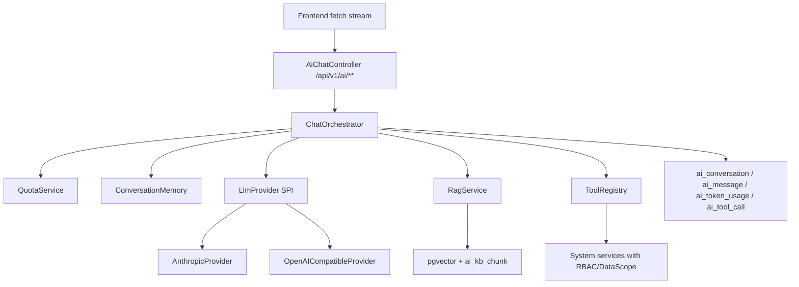

# AI 能力接入 Sprint 设计

## 结论

第一版 AI 能力不直接拆微服务, 新增 Maven 模块 `quantum-biz-ai` 跑在现有单体内。模块内部按未来 `ai-service` 拆分边界设计: Controller 只做 HTTP/SSE 协议, `ChatOrchestrator` 做会话编排, `LlmProvider` 做模型适配, `RagService` 做检索增强, `ToolRegistry` 做系统能力开放, `QuotaService` 和审计表独立计量。业务源码实现等 Claude review 后另开 sprint。



## 现有约束

- 项目是 Maven 多模块单体: root `pom.xml` 聚合 `quantum-common`, `quantum-biz-system`, `quantum-server`。
- 技术底座是 Spring Boot 4.1.0, Java 25, PostgreSQL, Redis/Local cache, MyBatis-Flex。
- 安全底座已有 JWT、RBAC、`@RequiresPermission`、数据权限、`@Sensitive` 脱敏、`RepeatSubmitFilter`、`RateLimitFilter`。
- 近期已完成 CORS 白名单、数据权限 fail-closed、登录态角色聚合数据权限、用户导入契约收敛。

## 模块边界

新增模块:

```text
quantum-biz-ai
  controller       # SSE / 对话 / KB 管理接口
  application      # ChatOrchestrator, command/query use cases
  provider         # LlmProvider SPI, Anthropic/OpenAI-compatible adapter
  rag              # 文档切分, embedding, 检索, rerank hook
  tool             # ToolRegistry, ToolExecutor, tool schema
  quota            # token 预检, 预扣, 回补, 用户/部门/租户额度
  persistence      # ai_* mapper/domain/dto
  security         # AiExecutionContext, ticket, audit redact
```

依赖方向:

```text
quantum-server -> quantum-biz-ai -> quantum-biz-system -> quantum-common/*
quantum-biz-ai -> quantum-common-security/cache/file/orm/framework/logging
quantum-biz-system 禁止反向依赖 quantum-biz-ai
```

拆服务时只移动 `quantum-biz-ai` 与 `ai_*` schema, 对外保留 `/api/v1/ai/**` API 和 ToolRegistry 契约。

## API 形态

| API | 方法 | 说明 | 鉴权 |
|---|---|---|---|
| `/api/v1/ai/chat/stream` | POST | fetch streaming; 支持 Authorization header; 默认方案 | `ai:chat:use` |
| `/api/v1/ai/chat/tickets` | POST | 生成一次性短时 stream ticket; EventSource 兼容方案 | `ai:chat:use` |
| `/api/v1/ai/chat/events?ticket=` | GET | SSE EventSource fallback; 只接受短时 ticket | ticket |
| `/api/v1/ai/conversations` | GET | 会话列表 | 数据权限 |
| `/api/v1/ai/kb/documents` | POST/GET/DELETE | KB 文档管理 | `ai:kb:*` |
| `/api/v1/ai/usage` | GET | token 用量 | 本人/管理员 |

默认前端用 `fetch` 读取 `ReadableStream`, 因为 WHATWG `EventSource` 构造只有 URL 和 `withCredentials`, 没有自定义 Authorization header 参数。需要原生 EventSource 时, 先换一次性 ticket。

## Provider 抽象

推荐自研薄 SPI, 同时保留 Spring AI adapter:

```java
public interface LlmProvider {
    String providerKey();
    LlmCapabilities capabilities();
    Flux<LlmDelta> stream(ChatRequest request, AiExecutionContext context);
    LlmResponse complete(ChatRequest request, AiExecutionContext context);
}
```

Provider 实现:

| Provider | 形态 | 说明 |
|---|---|---|
| `AnthropicProvider` | 官方 `anthropic-java` | Claude 特性优先: streaming, prompt caching, tool use, thinking。官方 README 当前 Maven 示例是 `com.anthropic:anthropic-java:2.48.0`, 云端旧方案的 `2.34.0` 上线前需复核。 |
| `OpenAICompatibleProvider` | HTTP adapter / Spring AI adapter | DeepSeek/Qwen/DashScope/OpenAI-compatible, 统一 baseUrl/model/apiKey。 |
| `SpringAiChatModelProvider` | 可选 adapter | 利用 Spring AI `ChatModel` / `StreamingChatModel` 做统一模型抽象, 但高级缓存/tool runner 不强行抹平。 |

模型路由不写死:

| 场景 | 默认策略 |
|---|---|
| 复杂推理、代码、长上下文 | 高推理模型配置组, 如 Claude Opus/Fable 级别 |
| 常规对话、业务问答 | 中档模型配置组, 如 Sonnet/Qwen max |
| 分类、摘要、标题、意图识别 | 轻模型配置组, 如 Haiku/DeepSeek chat |
| 受监管或国内环境 | OpenAI-compatible provider 优先 |

价格和模型 ID 进入配置中心/数据库, 不进入代码常量。Claude 官方 pricing 已显示 Sonnet 5 有 2026-08-31 前过渡价, 因此上线日必须重新核价。

## Prompt Caching

Claude provider 必须支持 cache-aware request builder:

- 系统提示词、工具定义、长 KB 背景放在稳定前缀。
- 动态用户消息、时间戳、traceId、权限快照放在缓存断点之后。
- `cache_control` 只由 provider adapter 生成, 不散落业务代码。
- 请求记录保存 `cache_creation_input_tokens` / `cache_read_input_tokens` 类指标, 用于成本回溯。

约束: 断点前内容必须字节级稳定, 不在 system prompt 里插当前时间、随机 ID、用户昵称等动态字段。

## SSE 与现有安全链冲突

| 冲突点 | 设计处理 |
|---|---|
| `RepeatSubmitFilter` | `/api/v1/ai/chat/stream`, `/api/v1/ai/chat/events` 排除; AI 幂等用 conversation/message nonce。 |
| `RateLimitFilter` | 流式端点排除 QPS 限流; 改由 `QuotaService` 做 token 预算和并发会话数。 |
| `server.compression` | `text/event-stream` 不压缩, 或对 AI stream path 禁用 compression, 避免缓冲破坏实时输出。 |
| EventSource 鉴权 | 默认 fetch stream 带 Authorization; EventSource fallback 使用短时 ticket。 |
| 虚拟线程 / ThreadLocal | `ChatOrchestrator` 接收显式 `LoginUserSnapshot`; tool 执行前用 scoped context 安装/清理 `UserContext`, 不依赖 `InheritableThreadLocal` 自动传播。 |
| DB 连接占用 | 流式生成期间不持有长事务; message 分段缓存内存/Redis, 完成后批量落库。 |

## Tool Use / MCP

核心规则: 模型只能提出工具调用请求, 权限裁决仍在业务层。

Tool 注册结构:

```text
AiToolDefinition
  name
  description
  inputSchema
  permissionCode
  dataScopeMode
  riskLevel: READ | EXPORT | WRITE | ADMIN
  executorBean
```

执行流程:

1. Orchestrator 把登录用户、会话、模型请求写入 `AiExecutionContext`。
2. 模型返回 tool use。
3. `ToolRegistry` 校验 tool allowlist、参数 schema、loop 上限。
4. `ToolExecutor` 以当前登录用户身份调用既有业务 service。
5. `PermissionAspect` 和数据权限链路仍做最终裁决。
6. `AiToolCallAudit` 记录 tool、参数摘要、结果摘要、权限失败、耗时和 token。

第一批工具只开放只读:

| Tool | 权限 | 数据权限 |
|---|---|---|
| `system.user.search` | `system:user:list` | 现有用户列表数据权限 |
| `system.dept.tree` | `system:dept:list` | 当前用户部门范围 |
| `system.role.list` | `system:role:list` | 管理权限 |
| `report.export.request` | `ai:report:export` | 需二次确认 |

MCP 不在第一版实现。后续 MCP Server 只包装同一个 ToolRegistry, 不重写业务逻辑; 外部 Agent 调用和内置模型调用共享权限、审计、限流和数据权限。

## RAG 与数据模型

向量库第一版用 pgvector。理由: 项目已用 PostgreSQL, pgvector 是 PostgreSQL 扩展, 可在同一事务/备份/权限体系下管理; 量大后再评估专用向量库。

表草案:

| 表 | 关键字段 |
|---|---|
| `ai_conversation` | `id`, `title`, `user_id`, `dept_id`, `status`, `last_message_at`, `create_by`, `create_time` |
| `ai_message` | `id`, `conversation_id`, `role`, `content_redacted`, `content_cipher`, `token_input`, `token_output`, `provider`, `model`, `create_by` |
| `ai_kb_document` | `id`, `name`, `source_type`, `file_id`, `dept_id`, `visibility`, `status`, `embedding_model`, `create_by` |
| `ai_kb_chunk` | `id`, `document_id`, `chunk_index`, `content_redacted`, `embedding vector(n)`, `metadata`, `dept_id` |
| `ai_token_usage` | `id`, `user_id`, `dept_id`, `provider`, `model`, `usage_date`, `input_tokens`, `output_tokens`, `cache_read_tokens`, `cost_amount` |
| `ai_tool_call` | `id`, `conversation_id`, `message_id`, `tool_name`, `permission_code`, `args_hash`, `status`, `duration_ms`, `create_by` |

RAG 查询必须同时做向量相似度与权限过滤:

```text
embedding similarity topK
  + document status
  + visibility
  + dept_id in LoginUser.deptIds
  + create_by/self when private
```

## 配额与成本

- `QuotaService.preflight()` 在模型请求前按预计 token 做预算检查。
- `QuotaService.reserve()` 用 Redis increment 做用户/部门/日维度预扣。
- stream 完成后按 provider usage 回补真实 token 和成本。
- stream 失败时按已消耗 token 结算, 释放未用预扣。
- 管理端后续提供模型成本报表, 第一版先落 `ai_token_usage`。

## 安全与审计

- API key 只来自环境变量、KMS 或外部 secret manager, 禁止入库或写入 yml。
- prompt/response 入库先走敏感信息脱敏; 原文如必须保留, 使用加密字段并受权限控制。
- tool 参数不落完整明文, 默认存 hash + 摘要。
- 高风险 tool: 写操作、导出、删除、批量修改必须二次确认。
- Tool loop 上限默认 5, 单次模型请求总时长默认 120 秒, 超时写入可恢复状态。
- prompt injection 防线: 工具白名单、参数 schema、系统指令和工具定义只由后端生成, RAG 内容永不覆盖系统策略。

## 迁移与拆服务触发

先单体, 满足任一条件再拆 `ai-service`:

- AI SSE 长连接或 token 突发影响 CRUD 接口稳定性。
- AI 模块需要独立扩容、独立发布或独立故障域。
- 后端团队达到 8 人左右并频繁互相阻塞发布。
- 出现第二个前台产品线复用同一 AI 能力。

拆分顺序:

```text
quantum-biz-ai -> ai-service
auth-service
剩余 system 单体
```

拆分前置: 网关、服务发现、统一鉴权 token introspection、AI service 到 system service 的内部调用鉴权。

## Sprint 拆分建议

| Sprint | 目标 | 退出标准 |
|---|---|---|
| AI-0 设计审核 | 本文档 + Claude review | 审核 PASS/CONCERNS, 明确选型 |
| AI-1 模块骨架 | `quantum-biz-ai`, Provider SPI, 配置, no-op provider test | `mvn test` 通过 |
| AI-2 SSE 对话 | fetch stream, ticket fallback, 安全过滤器排除, 显式上下文 | 本地 stream smoke test |
| AI-3 配额审计 | conversation/message/token_usage 表, Redis 配额 | 并发与失败回补测试 |
| AI-4 RAG | pgvector, KB 文档切分, embedding, 权限过滤 | 数据权限 RAG 测试 |
| AI-5 Tool Use | ToolRegistry, 只读工具, 权限审计 | 越权 tool 调用被拒绝 |
| AI-6 MCP 包装 | MCP Server 包装 ToolRegistry | 外部 agent 调用同权限链 |

## Claude 审核问题

1. `LlmProvider` 自研薄 SPI + Spring AI adapter 是否比直接全量 Spring AI 更适合当前 Claude 高级能力?
2. SSE 默认 fetch stream, EventSource 仅 ticket fallback, 是否符合前端框架计划?
3. `quantum-biz-ai -> quantum-biz-system` 的依赖方向是否会阻碍未来拆 `ai-service`?
4. RAG 第一版用 pgvector 是否足够, 是否需要从一开始抽象 VectorStore?
5. Tool 执行以业务 service 为唯一入口, 是否还需要额外的 tool-level ABAC 策略表?
6. prompt/response 原文是否允许加密保存, 或第一版只保存脱敏文本?

## 官方来源

- Anthropic Java SDK README: https://github.com/anthropics/anthropic-sdk-java
- Anthropic Java SDK docs: https://platform.claude.com/docs/en/api/sdks/java
- Anthropic streaming docs: https://platform.claude.com/docs/en/build-with-claude/streaming
- Anthropic prompt caching docs: https://platform.claude.com/docs/en/build-with-claude/prompt-caching
- Anthropic pricing docs: https://platform.claude.com/docs/en/about-claude/pricing
- Spring AI ChatModel docs: https://docs.spring.io/spring-ai/reference/api/chatmodel.html
- Spring AI PGvector docs: https://docs.spring.io/spring-ai/reference/api/vectordbs/pgvector.html
- pgvector README: https://github.com/pgvector/pgvector
- WHATWG EventSource spec: https://html.spec.whatwg.org/multipage/server-sent-events.html
